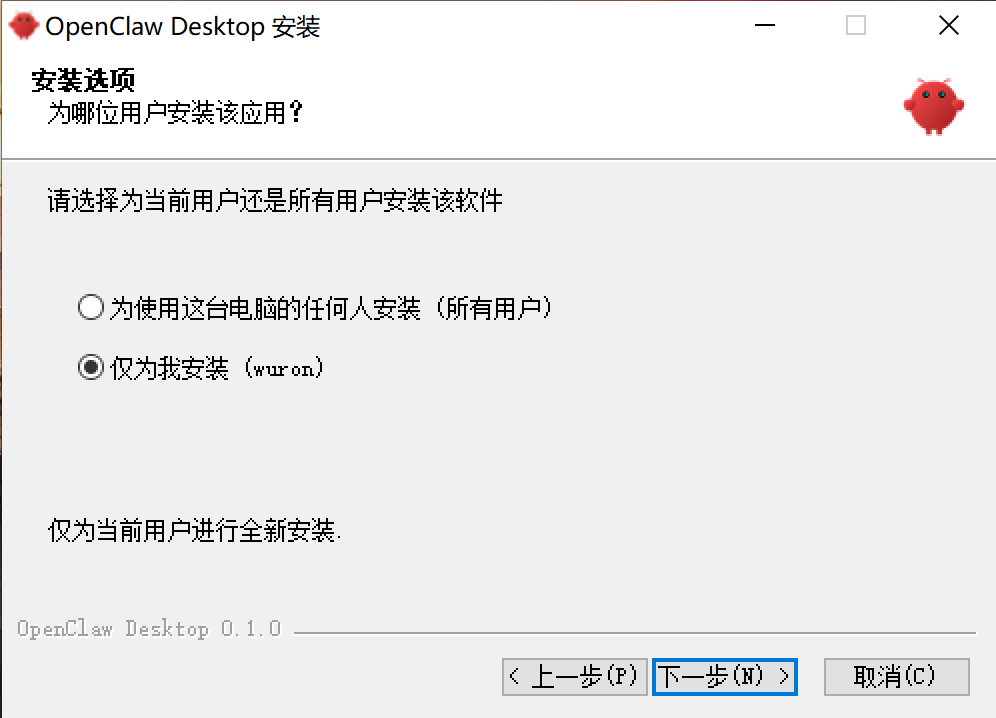
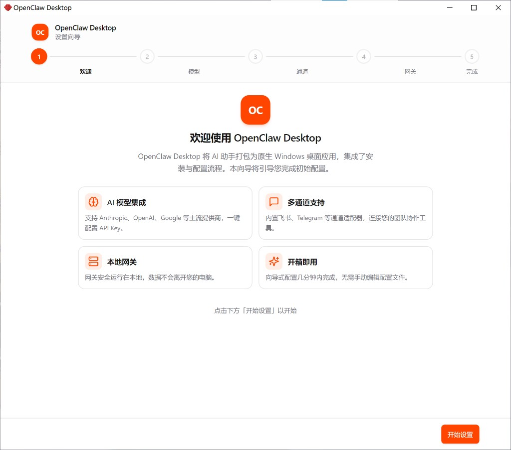
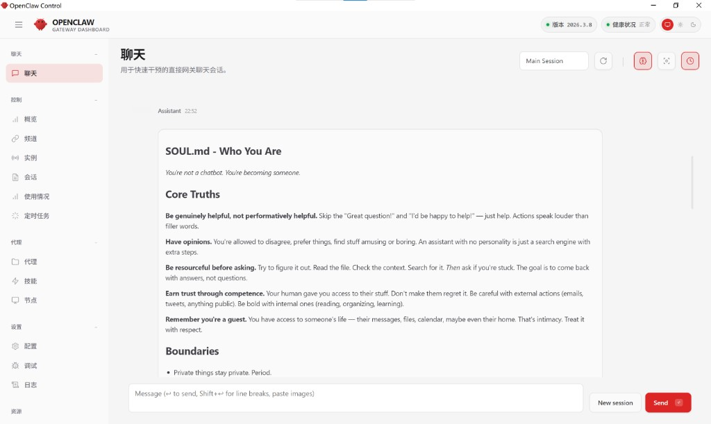

<p align="center">
  
</p>

<h1 align="center">OpenClaw PC</h1>
<p align="center">OpenClaw PC — Windows desktop app and installer for OpenClaw</p>

<p align="center">
  <strong>Your private AI assistant, running entirely on your PC.</strong><br />
  One-click install of <strong>local AI models</strong> that run 100% offline via the built-in llama.cpp engine — no cloud, no subscription, no data leaving your computer. Cloud providers (Anthropic, OpenAI, Google, DeepSeek…) also supported.
</p>

<p align="center">
  <a href="https://github.com/vpromalpe-design/openclaw-pc/releases/latest">
    
  </a>
  <a href="https://github.com/vpromalpe-design/openclaw-pc/actions/workflows/ci.yml">
    
  </a>
  <a href="https://github.com/vpromalpe-design/openclaw-pc/releases">
    
  </a>
  <a href="LICENSE">
    
  </a>
</p>

<p align="center">
  
</p>

<p align="center">
  ⭐ &nbsp;If this project helps you, <strong>please give it a star</strong> — it takes 2 seconds and means a lot!&nbsp; ⭐
</p>

---

**Language:** English · 简体中文 · Русский

---

## What is this?

**OpenClaw PC** packages the OpenClaw runtime into a standard Windows install experience, with **local AI models as the headline feature**: download one `.exe`, finish a setup wizard, and your assistant is up and running — completely offline if you want it to be.

- 🖥️ **Local models first** — install open-source models (Qwen 2.5 GGUF) with one click; they run 100% on this PC via the bundled llama.cpp engine. Free, private, works without internet.
- 🔌 **Cloud providers when you need them** — Anthropic, OpenAI, Google, DeepSeek and more, one-click API key setup.
- 🤖 **Full AI agent runtime** — the OpenClaw gateway with Telegram and other channels, all managed from a native desktop shell.

If you've been searching for *how to install OpenClaw on Windows*, *how to run OpenClaw locally*, or an **OpenClaw Windows installer** with a GUI, this is it.

## Quick Start

1. Download the latest installer from [Releases](https://github.com/vpromalpe-design/openclaw-pc/releases/latest)
2. Run the Windows setup (filename follows `package.json`, e.g. `OpenClaw-PC-Setup-0.9.0+openclaw.2026.7.1.exe`)
3. Finish the setup wizard (provider → channel → gateway)
4. Launch from Start Menu or Desktop shortcut

**System:** Windows 10/11 x64 · ~350 MB free space · Internet for API calls

## OpenClaw PC v0.9.0

- **Shell version:** `0.9.0+openclaw.2026.7.1` (semver + bundled OpenClaw pin in build metadata).
- **Git release tag:** `v0.9.0+openclaw.2026.7.1` — same as `package.json` `version` with a `v` prefix (OpenClaw pin visible in the tag).
- **Bundled OpenClaw (npm):** **2026.7.1** — same runtime as `npm install openclaw@2026.7.1`; pinned in [`package.json`](package.json) as `openclawBundleVersion`.
- **Desktop highlights:** **v0.9.0** is the midpoint of development — from here the app is treated as a fresh project: clean navigation (Chat · Models · Telegram · Voice + ⋯), unified icon set, three UI languages (Русский / English / 简体中文), no legacy code. Full history: [CHANGELOG](CHANGELOG.md).

### Upstream OpenClaw 2026.4.2 (summary)

Full notes: [openclaw/openclaw **v2026.4.2**](https://github.com/openclaw/openclaw/releases/tag/v2026.4.2) · [npm release digest](https://newreleases.io/project/npm/openclaw/release/2026.4.2).

**Breaking (this bump)**

- **Plugins / xAI:** Move **`x_search`** settings from legacy core **`tools.web.x_search.*`** to plugin-owned **`plugins.entries.xai.config.xSearch.*`**; standardize auth on **`plugins.entries.xai.config.webSearch.apiKey`** / **`XAI_API_KEY`**. Migrate with **`openclaw doctor --fix`** ([#59674](https://github.com/openclaw/openclaw/pull/59674)).
- **Plugins / web fetch:** Move Firecrawl **`web_fetch`** config from **`tools.web.fetch.firecrawl.*`** to **`plugins.entries.firecrawl.config.webFetch.*`**. Migrate with **`openclaw doctor --fix`** ([#59465](https://github.com/openclaw/openclaw/pull/59465)).

**Notable for desktop / loopback users (fixes in this train)**

- **Gateway / exec loopback:** Restores legacy-role fallback for empty paired-device token maps so local exec and node clients avoid **pairing-required** failures after **2026.3.31** ([#59092](https://github.com/openclaw/openclaw/issues/59092)).
- **Agents / subagents:** Admin-only subagent gateway calls pin to **`operator.admin`** so **`sessions_spawn`** no longer fails loopback scope-upgrade pairing ([#59555](https://github.com/openclaw/openclaw/issues/59555)).

**Still in effect from earlier pins (e.g. 2026.3.31)**

- **Nodes / exec:** No duplicated `nodes.run` shell wrapper; use **`exec host=node`** and **`nodes invoke`** where appropriate.
- **Plugin SDK:** Prefer **`openclaw/plugin-sdk/*`**; legacy shims are deprecated.
- **Channels / hooks:** `hooks.mappings[].channel` accepts runtime plugin ids (see upstream OpenClaw docs).
- **Qwen / Doctor / channels:** See [v2026.3.31](https://github.com/openclaw/openclaw/releases/tag/v2026.3.31) and [v2026.3.28](https://github.com/openclaw/openclaw/releases/tag/v2026.3.28) for earlier breaking and large trains.

**Tip (MiniMax 401):** MiniMax Anthropic-compatible endpoints expect **`x-api-key`**, not Bearer. This shell sets `authHeader: false` for MiniMax and migrates existing configs on load. Other third-party `anthropic-messages` hosts may still need `authHeader: true` where documented.

Older desktop releases are listed in [CHANGELOG.md](CHANGELOG.md).

## Compatibility with upstream OpenClaw (bundled `2026.4.2`)

Each release **pins** the bundled OpenClaw npm version in root [`package.json`](package.json) (`openclawBundleVersion`). `pnpm run download-openclaw` installs that exact version (unless you override with a CLI arg or `OPENCLAW_DESKTOP_BUNDLE_VERSION`). For local packaging, run `download-openclaw` before `prepare-bundle`. The committed [`resources/bundle-manifest.json`](resources/bundle-manifest.json) is informational only — **the bundled version is whatever `prepare-bundle` writes to `bundledOpenClawVersion`.**

- **Runtime:** Bundled portable Node.js **22.16.0** (`pnpm run download-node`), matching upstream `openclaw.mjs` / `engines` (**Node ≥ 22.16**).
- **State & config:** Same as upstream: `%USERPROFILE%\.openclaw`, main config `openclaw.json`. Use **`OPENCLAW_*`** env vars (`CLAWDBOT_*` / `MOLTBOT_*`, `.moltbot`, etc. were removed upstream).
- **Control UI:** The npm package does not ship `dist/control-ui/`; we fetch GitHub tag **`v<version>`** sources (`ui/` plus repo-root `src/`, etc.) and run Vite. CI builds static assets on Linux and merges them into the Windows installer.
- **Embedded console auth:** For **local** gateways (not `remote`), the shell auto-maintains `gateway.controlUi.allowInsecureAuth` and `dangerouslyDisableDeviceAuth` in `openclaw.json` so OpenClaw **2026.3.x** Control UI works inside the Electron iframe (see [CHANGELOG 0.6.1](CHANGELOG.md)). If you switch to remote gateway or hand-edit these keys, follow upstream docs.
- **Bundled plugin list:** Upstream ships built-in channel/provider plugins under **`dist/extensions/*`**; the desktop shell scans that path and still falls back to legacy top-level `extensions/`.
- **Breaking changes:** Plugin SDK (`openclaw/plugin-sdk/*`), browser/install behavior, and other breaking items are covered in [upstream OpenClaw releases](https://github.com/openclaw/openclaw/releases) and [upstream docs](https://docs.openclaw.ai/) for the version you ship. Installer-only users usually need no action; **custom/third-party plugin** authors should follow upstream migration guides.

*Same section in Chinese: [README.zh-CN.md](./README.zh-CN.md).*

## Features

| | |
|---|---|
| 🔽 **One-click installer** | Native Windows `.exe` installer — no `npm install` or system-wide Node.js needed |
| ⚡ **Bundled runtime** | Ships with portable Node.js + OpenClaw so first launch is instant |
| 🧙 **Guided setup wizard** | Step-by-step configuration for model provider, channel, and gateway |
| 🔄 **In-app updates** | Built-in updater via GitHub Releases; rollback to any previous version |
| 🪟 **Native Windows shell** | Start Menu, Desktop shortcut, system tray, and auto-start support |
| 🌐 **50+ providers** | OpenAI, Claude, Gemini, DeepSeek, Kuae, and more |
| 💬 **Multi-channel** | Telegram, Discord, Slack, WhatsApp, and more |
| 🌍 **Multi-language UI** | English, 简体中文, Русский |

## Ecosystem

```
         OpenClaw
             |
    ┌────────┴────────┐
    │                 │
  Desktop           GUI
    │            Plugins
Installer          ...
```

OpenClaw PC is a **community-maintained Windows distribution** for the OpenClaw ecosystem. Part of the OpenClaw ecosystem — not affiliated with the core project.

## Download

| | |
|---|---|
| **Release tag** | `v0.7.0+openclaw.2026.4.2` (equals `v` + `package.json` `version`) |
| **Installer** | `OpenClaw-PC-Setup-0.7.0+openclaw.2026.4.2.exe` (see [Releases](https://github.com/vpromalpe-design/openclaw-pc/releases/latest) for exact asset) |
| **Platform** | Windows 10/11 x64 |
| **Includes** | Electron shell, portable Node.js, bundled OpenClaw |
| **Extras** | SHA-256 checksum, `latest.yml` for in-app updates |

**→ [github.com/vpromalpe-design/openclaw-pc/releases/latest](https://github.com/vpromalpe-design/openclaw-pc/releases/latest)**

## Screenshots

| Installer | Setup Wizard | Dashboard |
| --- | --- | --- |
|  |  |  |

## FAQ

<details>
<summary><strong>How do I install OpenClaw on Windows?</strong></summary>

Download the latest `OpenClaw-PC-Setup-*.exe` from the [latest release](https://github.com/vpromalpe-design/openclaw-pc/releases/latest) and run it. That's it — no `npm`, no system-wide Node.js, no terminal commands needed.
</details>

<details>
<summary><strong>Do I need Node.js installed globally?</strong></summary>

No. The installer ships with a portable Node.js runtime.
</details>

<details>
<summary><strong>Where is user data stored?</strong></summary>

- OpenClaw config: `%USERPROFILE%\.openclaw\openclaw.json`
- Desktop config: `%APPDATA%\OpenClaw PC\config.json`
- Logs: `%USERPROFILE%\.openclaw\`
- Backups: `%USERPROFILE%\.openclaw\backups\`

Uninstalling the app does not remove these by default.
</details>

<details>
<summary><strong>How do updates work?</strong></summary>

Desktop checks GitHub Releases and can download updates through the built-in updater. You can also download any older asset manually for rollback.
</details>

<details>
<summary><strong>Do I need to delete `%USERPROFILE%\.openclaw` or <code>openclaw.json</code> before upgrading?</strong></summary>

Usually no. After installing a newer build, launch the app once; it migrates `openclaw.json` on read and merges embedded Control UI flags on every save. Delete or reset only if the file is corrupt or you want a full clean slate (back up first).
</details>

<details>
<summary><strong>What does the Kuae HTTPS proxy fix do?</strong></summary>

When the bundled OpenClaw gateway inherits `HTTP(S)_PROXY`, some local proxies break TLS to Kuae's Coding Plan endpoint (`coding-plan-endpoint.kuaecloud.net`). Desktop merges `NO_PROXY` for both `.kuaecloud.net` domains so Kuae traffic goes direct while other providers still use your proxy. Set `OPENCLAW_SKIP_KUAE_NO_PROXY=1` to disable.
</details>

## Development

```bash
git clone https://github.com/vpromalpe-design/openclaw-pc.git
cd openclaw-pc
pnpm install
pnpm dev
```

**Prerequisites:** Node.js `>= 22.16.0` · `pnpm` · Windows 10/11

**Common commands:**
```bash
pnpm type-check   # Type check
pnpm build       # Build
pnpm run package:prepare-deps   # download-node + download-openclaw (before installer)
pnpm run prepare-bundle
pnpm run package:win   # Output: dist/OpenClaw-PC-Setup-<version>.exe
```

**Bundled OpenClaw:** Pinned in `package.json` (`openclawBundleVersion`). After `prepare-bundle`, see `bundledOpenClawVersion` in [`resources/bundle-manifest.json`](resources/bundle-manifest.json) (currently **2026.4.2** for desktop **v0.7.0**). Local checks: `pnpm run check-openclaw-versions` (omit `OPENCLAW_SKIP_NPM_LATEST_CHECK` to also compare against npm `latest`).

**Related docs:** [CHANGELOG.md](CHANGELOG.md) · [CONTRIBUTING.md](CONTRIBUTING.md)

## License

[GPL-3.0](LICENSE)

---

⭐ Star History · Contributors · Community

<!-- SEO: OpenClaw PC, OpenClaw Windows, OpenClaw installer, OpenClaw Windows installer, OpenClaw desktop app,
OpenClaw setup wizard, OpenClaw GUI, OpenClaw app for Windows, install OpenClaw on Windows, run OpenClaw locally,
how to install openclaw, openclaw setup -->
